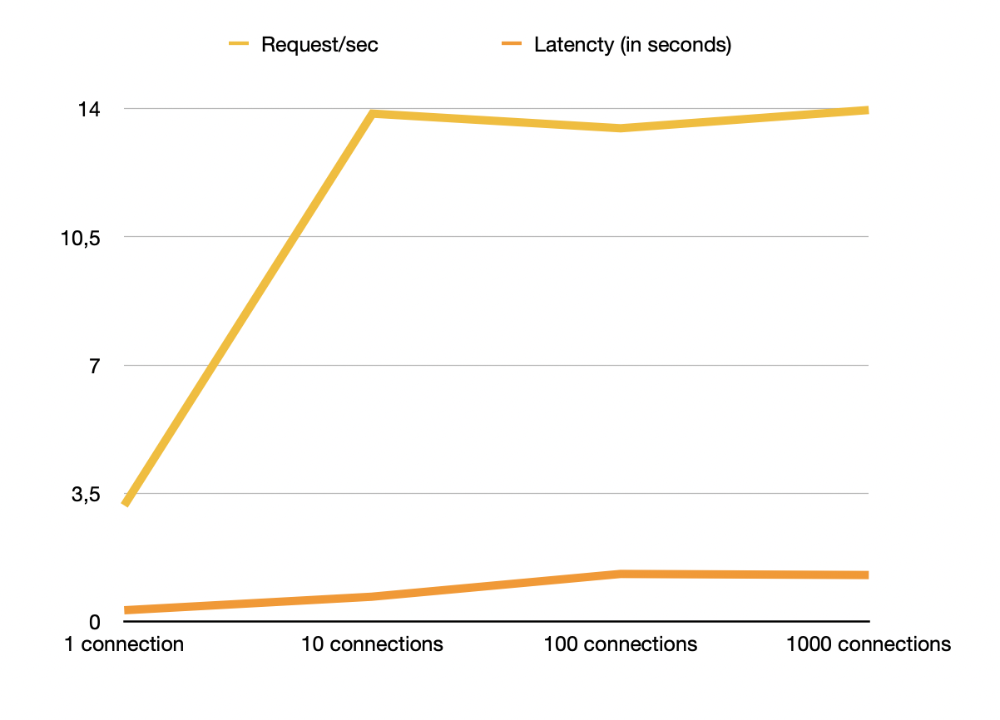
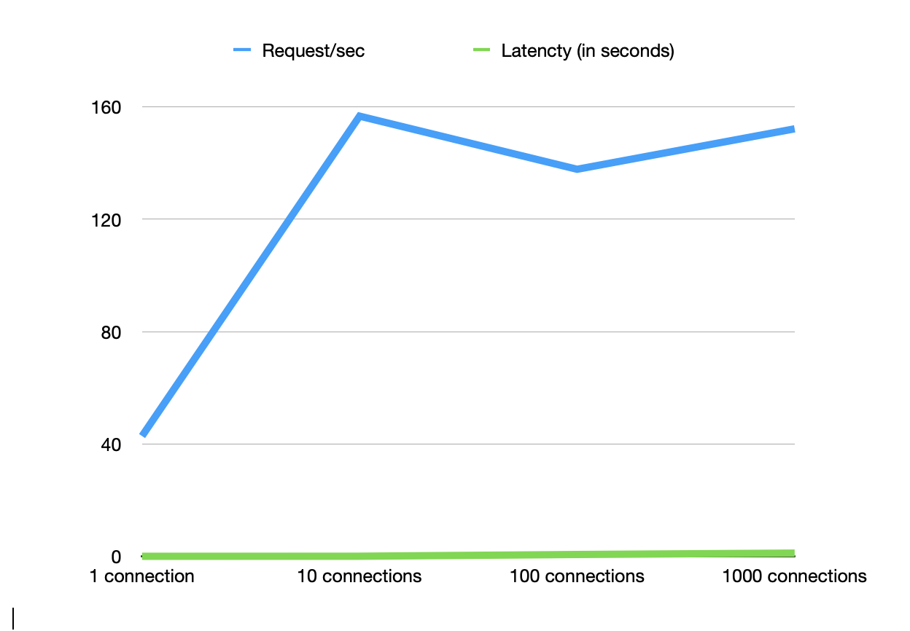

# Производительность индексов

## Запрос для поиска анкет по префиксу имени и фамилии (одновременно)
```sql
SELECT * FROM user WHERE name like 'А%' and last_name like 'Б%' LIMIT 100;
```
- План запроса без индекса
```
+--+-----------+-----+----------+----+-------------+----+-------+----+------+--------+-----------+
|id|select_type|table|partitions|type|possible_keys|key |key_len|ref |rows  |filtered|Extra      |
+--+-----------+-----+----------+----+-------------+----+-------+----+------+--------+-----------+
|1 |SIMPLE     |user |NULL      |ALL |NULL         |NULL|NULL   |NULL|991815|1.23    |Using where|
+--+-----------+-----+----------+----+-------------+----+-------+----+------+--------+-----------+
```

## Нагрузочные тесты с wrk
```shell script
wrk -t1 -c1 -d5s -s study/stressTesting/search-test.lua --latency http://localhost
```
- [Скрипт для генерации запросов на Lua](search-test.lua)
- Результаты
```
Load    Requests/sec:	LatencyAvg  LatencyMax
1000 	13.96	        1.27s	    1.97s
100     13.46	        1.30s	    1.92s
10      13.86	        680.39ms	1.27s
1       3.17	        309.35ms	388.23ms
```



## Запрос построения индекса
```sql
CREATE INDEX name_last_name_idx ON users(name, last_name); # в MYSQL по дефолту создается BTREE индекс
```
- Индекс такой, тк поиск по name, last_name, может быть только по name и нужна упорядоченность
- Explain
```
+--+-----------+-----+----------+-----+------------------------+------------------------+-------+----+------+--------+---------------------+
|id|select_type|table|partitions|type |possible_keys           |key                     |key_len|ref |rows  |filtered|Extra                |
+--+-----------+-----+----------+-----+------------------------+------------------------+-------+----+------+--------+---------------------+
|1 |SIMPLE     |user |NULL      |range|name_last_name_idx      |name_last_name_idx      |304    |NULL|440450|11.11   |Using index condition|
+--+-----------+-----+----------+-----+------------------------+------------------------+-------+----+------+--------+---------------------+
```

- Результаты нагрузочных тестов с wrk
```
Load	            Requests/sec:	Latency Avg
1000 connections    152.15	        1.18s
100 connections	    137.75	        680.49ms
10 connections	    155.63	        69.34ms
1 connections	    42.83	        40.63ms
```


